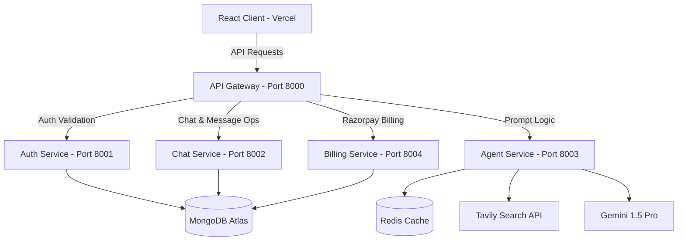

# CortexAI 🧠✨

CortexAI is a premium, multi-agent AI workspace designed for code generation, real-time web searches, document processing, and interactive agent discussions. Built with a highly responsive, modern glassmorphic dashboard, it features a scalable microservices architecture routed through an API Gateway, backed by Redis and MongoDB.

🚀 **[Live Demo Link (Replace with your Vercel URL)]**

---

## 🌟 Key Features

* **Intelligent Multi-Agent System**: Routes user prompts to specialized autonomous agents (Coding, Web Search, and Chat) powered by Google Gemini.
* **Real-time Web Search Agent**: Utilizes Tavily Search API to scrape, clean, and format live updates directly into assistant bubbles.
* **Premium Coding Agent with Live Sandbox**: Generates clean HTML, CSS, and JS components and renders them side-by-side inside an interactive, Monaco-powered preview sandbox.
* **Flexible UI Modes (Classic vs Neo-Glass)**: Includes a live switcher to swap between traditional glass chat bubbles and an ultra-modern, centered chat-stream layout inspired by Claude and ChatGPT.
* **Billing & Credits Integration**: Fully integrated Stripe/Razorpay payment gateway, complete with dynamic profile credit deductions and tier upgrades.
* **Obsidian Canvas with Drifting Glows**: Embellished with slow-warping ambient glows, high-tech grid textures, and smooth Framer Motion micro-animations.

---

## 🛠️ Technology Stack

### Frontend (Client)
* **Core**: React 19, Vite, Tailwind CSS v4, ES Modules
* **Animations**: Framer Motion
* **Utilities**: Axios, React Router, Lucide Icons, Monaco Code Editor
* **State Management**: Redux Toolkit

### Backend (Microservices)
* **API Gateway**: Express-based central routing gateway
* **Microservices**:
  * **Auth Service**: Google Firebase Authentication
  * **Chat Service**: MongoDB database bindings for messages and histories
  * **Agent Service**: LangGraph supervisor node logic routing prompts to Gemini
  * **Billing Service**: Razorpay order configuration and payment verification
* **Databases & Caching**: MongoDB Atlas (Primary Database), Redis Cache (Session and state caching)
* **Containers**: Docker, Docker Compose

---

## 📂 Project Architecture



---

## ⚡ Quick Start

### Local Development
To run all services locally in development mode:

1. **Install root dependencies**:
   ```bash
   npm install
   ```
2. **Start all backend microservices**:
   * Navigate to each folder inside `backend/services/` and `backend/gateway/`, copy `.env.example` to `.env`, install dependencies, and run:
   ```bash
   npm run dev
   ```
3. **Start the React client**:
   ```bash
   cd frontend
   npm run dev
   ```

### Production Docker Container
Deploy the entire backend stack with a single command:
```bash
cd backend
docker compose -f docker-compose.prod.yml up --build -d
```
*(Refer to [DEPLOYMENT.md](file:///c:/Users/Saksham%20Singla/OneDrive/Desktop/cortex-ai/DEPLOYMENT.md) for full cloud configuration steps).*
