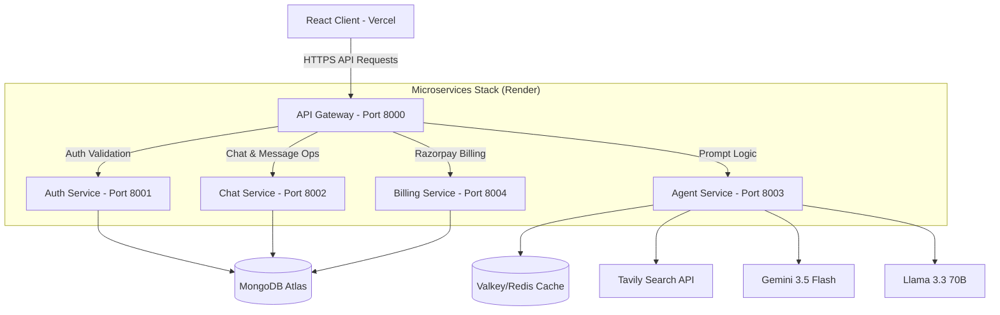

<h1 align="center">
  AetherAI
</h1>

<p align="center">
  Aether is a premium, multi-agent AI workspace designed for code generation, real-time web searches, document processing, and interactive agent discussions. Built with a calm, typography-centric neutral workspace inspired by ex-Apple and Linear interfaces, it features a scalable microservices architecture routed through an API Gateway, backed by Redis and MongoDB.
</p>

<p align="center">
  <a href="https://aether--ai-jet.vercel.app/">
    
  </a>
  <a href="#production-docker-container">
    
  </a>
  <a href="#deployment">
    
  </a>
</p>

---

## 🌟 Key Features

| Feature | Description |
| :--- | :--- |
| **🤖 Intelligent Multi-Agent System** | Dynamic routing of user prompts to specialized autonomous agents (Coding, Web Search, and Chat) powered by Gemini and Llama. |
| **🔍 Real-Time Web Search** | Scrapes, cleans, and structures live web data using the Tavily Search API directly into the assistant stream. |
| **💻 Interactive Coding Sandbox** | Generates clean HTML, CSS, and JS components and renders them in real time inside a side-by-side Monaco code editor sandbox. |
| **🎨 Premium Dual Aesthetics** | Monochromatic view switcher to swap between a quiet editorial text layout (Minimal Mode) and sharp, outlined graphite cards (Glass Mode). |
| **💳 Billing & Credits Integration** | Fully integrated Razorpay payment gateway for custom plan upgrades and dynamic credit balances. |
| **✨ Monochromatic Editorial Design** | Redesigned from first principles with matte carbon tones, subtle borders, system monospace type, and quiet micro-animations. |

---

## 🛠️ Technology Stack

```
   FRONTEND                       GATEWAY & CACHE                  MICROSERVICES
  ┌──────────────┐                 ┌──────────────┐                 ┌─────────────────┐
  │ React 19     │ ──────────────> │ Express API  │ ──────────────> │ Auth (Firebase) │
  │ Vite         │                 │ Gateway      │                 │ Chat (MongoDB)  │
  │ Tailwind CSS │                 └──────┬───────┘                 │ Agent (Gemini)  │
  │ Redux Toolkit│                        │                         │ Billing (Razor) │
  └──────────────┘                        v                         └─────────────────┘
                                   ┌──────────────┐
                                   │ Redis Cache  │
                                   └──────────────┘
```

### Frontend (Client)
* **Core**: React 19, Vite, Tailwind CSS v4, ES Modules
* **Animations**: Framer Motion
* **Utilities**: Axios, React Router, Lucide Icons, Monaco Code Editor
* **State Management**: Redux Toolkit

### Backend (Microservices)
* **API Gateway**: Express-based central routing gateway
* **Microservices**:
  * **Auth Service**: Google Firebase Authentication (First-party proxied via Vercel for storage-partitioning protection)
  * **Chat Service**: MongoDB database bindings for messages and histories
  * **Agent Service**: LangGraph supervisor node logic routing prompts dynamically to Google Gemini & Groq/Llama
  * **Billing Service**: Razorpay order configuration and payment verification
* **Databases & Caching**: MongoDB Atlas (Primary Database), Redis Cache (Resilient session and state caching with fast failovers)
* **Containers**: Docker, Docker Compose

---

## 📂 System Architecture

The following diagram illustrates the flow of requests from the Vercel client through the API Gateway to individual microservices on Render's private network:



---

## ⚡ Quick Start

### Local Development
To run all services locally in development mode:

1. **Install root dependencies**:
   ```bash
   npm install
   ```
2. **Start all backend microservices**:
   * Navigate to each folder inside `backend/services/` and `backend/gateway/`, copy `.env.example` to `.env`, install dependencies, and run:
   ```bash
   npm run dev
   ```
3. **Start the React client**:
   * Navigate to the frontend directory:
   ```bash
   cd frontend
   npm run dev
   ```

### Production Docker Container
To deploy the entire backend stack with a single command:
```bash
cd backend
docker compose -f docker-compose.prod.yml up --build -d
```

---

## 🚀 Deployment

The production instances of this project are configured and deployed on:
* **Frontend**: Vercel (Static site hosting with first-party same-origin auth proxy rewrites)
* **Backend Services**: Render (Docker-container-based web services)
* **Session Cache**: Render Valkey/Redis instance
